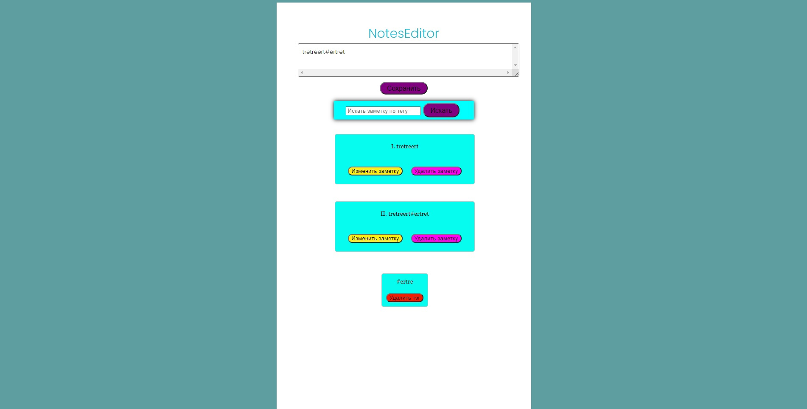

# Note editor with tags

## Actions:

- Create, edit, view and delete notes;
- Filter notes by tag;
- Adding and removing tags from the list.
- Store data in a json file.
- Using the CSS preprocessor.

## Usage

To start it

`npm i`

Then

`npm start`

### Coded by [EalsyCoD](https://github.com/EalsyCoD)
